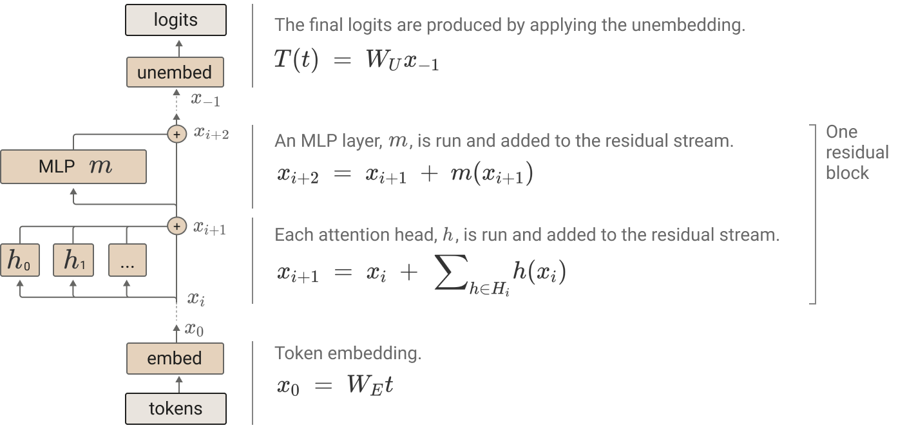

# Review of "[A Mathematical Framework for Transformer Circuits](https://transformer-circuits.pub/2021/framework/index.html)"

## Что такое residual block?
Сумма выходов всех предыдущих слоев и исходного эмбеддинга токена. Вместо того чтобы полностью преобразовывать данные от слоя к слою, трансформер сохраняет общую «шину» данных, в которую каждый блок вносит свои правки. Слои (внимание и MLP) считывают информацию из потока и записывают свои результаты обратно в него путем добавления векторов

$x^{(out)} = x^{(in)} + \sum_{h \in H} h(x^{(in)}) + \text{MLP}(x^{(in)})$

или

$x_{l+1} = x_l + F(x_l)$

Мои тупые вопросы:
-  но у трансформера же есть еще residual connections, как они попадают в residual block?
-  разве выход Residual Block будет равен выходу модели(мы как минимум нарушаем изначальную логику transformer'а)? выход трансформера равен SoftMax(Linear(LayerNorm(MLP(LayerNorm(Attention(x * W_embedding) + (x * W_embedding))))+ (LayerNorm(Attention(x * W_embedding) + (x * W_embedding)))))) - это нелинейное преобразование как минимум из-за ReLU и LayerNorm (**записки**)

**Ответ:**
- (Model Simplifications) в данной статье не затрагиваются MLP блоки, т.к. они сложны для анализа, следовательно не сталкиваемся с ReLU

- (OBSERVATIONS ABOUT ATTENTION HEADS) attention из-за softmax тоже нелинеен, поэтому мы "фиксируем аттеншен паттерны (SoftMax(QK))", т.е. SoftMax(QK) = const для этого токена

- (Model Simplifications) LayerNorm нелинеен, но мы считаем, что LayerNorm - это просто масштабирование вектора на некую константу C. А умножение на константу — это линейная операция. Мы можем "вшить" это в другие веса.

## Virtual Weights
Поскольку Остаточный поток работает только через сложение (он линеен), авторы применяют математический трюк.

Обычно в коде у нас есть отдельные матрицы:
- $W_E$ — матрица эмбеддингов (превращает слово в вектор).
- $W_OV$ — матрица головы внимания (решает, что передать).

- $W_U$ — матрица анэмбеддинга (превращает вектор в вероятности следующего слова).

Вместо того чтобы прогонять данные шаг за шагом, мы можем математически перемножить эти три матрицы напрямую: $W_E$ × $W_OV$ × $W_U$.
Результатом будет одна гигантская матрица (размером словарь × словарь). Это и есть Виртуальные веса.

Почему это гениально? Эта виртуальная матрица позволяет напрямую, без запуска нейросети, прочитать: "Если на вход этой голове подать слово 'Гарри', она напрямую увеличит вероятность слова 'Поттер' на выходе на +5.2". Эти веса называются «виртуальными», потому что физически в памяти видеокарты они не хранятся в таком виде, но математически они точно описывают сквозное поведение сети

## Общая картина статьи: Эволюция трансформеров

Авторы анализируют трансформеры, начиная с самых примитивных, чтобы показать, как усложняется логика:

- Трансформер с 0 слоев (Только $W_E$ и $W_U$): Не имеет механизмов внимания. Способен только выучить статистику биграмм (например, что после слова «Нью» часто идет «Йорк»). Это просто таблица переходов.

- Трансформер с 1 слоем (Только внимание, без MLP):
Появляются головы внимания, но они не могут общаться друг с другом. Каждая голова просто берет слово из контекста и копирует его смысл в текущую позицию. Авторы называют их ансамблем skip-gram моделей (моделей, предсказывающих слова с пропуском).

- Трансформер с 2 слоями (Магия композиции и Индукционные головы):
Здесь происходит прорыв. Голова на 2-м слое теперь может читать то, что записала голова на 1-м слое. Возникают Индукционные головы (Induction Heads).

- - Как это работает: Представьте текст ... мистер Смит ... мистер [?].

- - Голова 1-го слоя смотрит на Смит и записывает в него: «перед мной было слово 'мистер'».

- - Голова 2-го слоя (когда мы дошли до второго 'мистер') ищет в прошлом слово, в котором есть пометка «передо мной было слово 'мистер'». Она находит Смит и копирует его в ответ.

- - Сеть научилась продолжать паттерны! Это базовый механизм того, как LLM учатся решать задачи in-context (прямо в промпте).